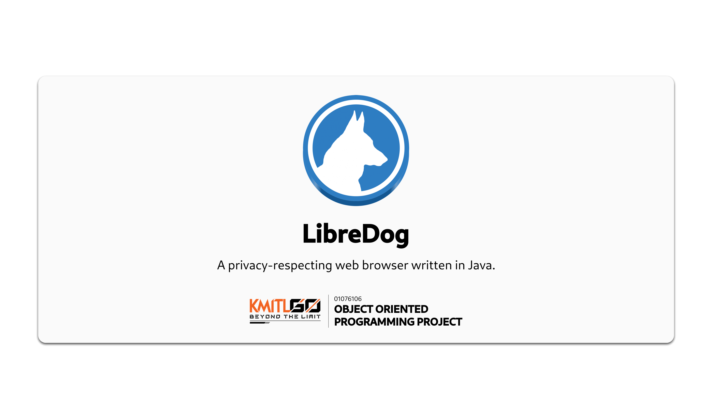
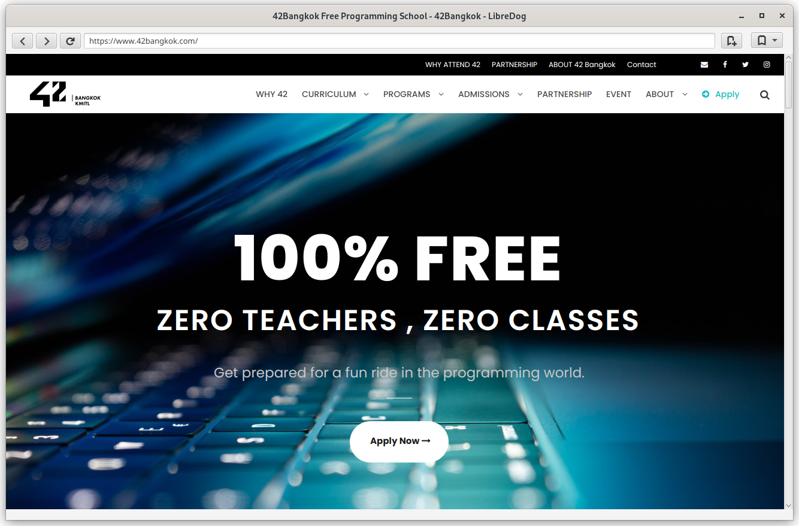
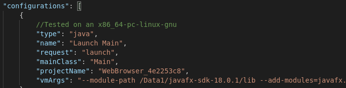
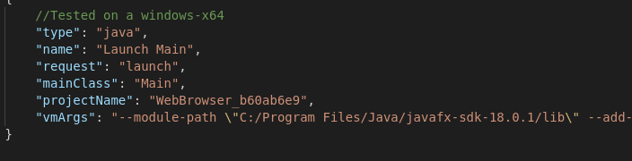

LibreDog is a web browser written in Java, utilizing the JavaFX platform. The browser is based on WebKit, that is an open source web browser engine that supports HTML5, JavaScript, CSS, DOM rendering and SVG graphics.

## Screenshot



## Building

Tested with Amazon Corretto 18 and JavaFX SDK 18.

1. Clone this repository with `git clone` (or Download ZIP and extract to your desired folder).

2. Open the project folder in Visual Studio Code or VSCodium

3. Go to `.vscode/launch.json` and add vmArgs under configurations

```
"vmArgs": "--module-path /path/to/lib --add-modules=javafx.controls,javafx.fxml --add-modules=javafx.swing,javafx.graphics,javafx.fxml,javafx.media,javafx.web --add-reads javafx.graphics=ALL-UNNAMED --add-opens javafx.controls/com.sun.javafx.charts=ALL-UNNAMED --add-opens javafx.graphics/com.sun.javafx.iio=ALL-UNNAMED --add-opens javafx.graphics/com.sun.javafx.iio.common=ALL-UNNAMED --add-opens javafx.graphics/com.sun.javafx.css=ALL-UNNAMED --add-opens javafx.base/com.sun.javafx.runtime=ALL-UNNAMED"
```


On Linux:



On Windows:



4. Build the workspace and enjoy!

## Meet the team

- [64010543 พงศ์ภีระ วงศประสิทธิพร](https://github.com/SashaPGT)
- [64010575 พัชรพล แก้วริพร](https://github.com/patcharapon411)
- [64010823 วีรภัทร อินอุดม](https://github.com/NekoVari)
- [64010860 ศุภพล อารีวัฒนวงศ์](https://github.com/16sakuraa)